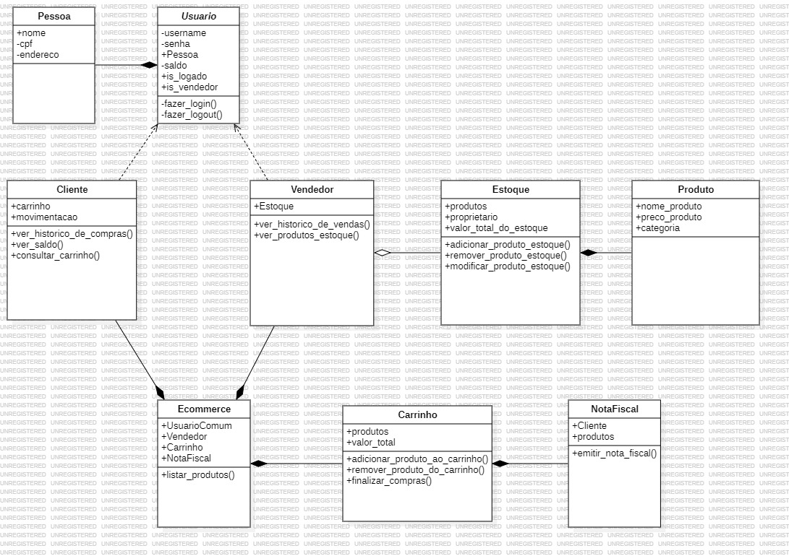

# Ecommerce

Este repositório faz parte de um projeto colaborativo de ecommerce, criado com o objetivo de praticar e reforçar os conceitos essenciais da programação, bem como a colaboração em equipe dentro de um ambiente de desenvolvimento.

## Objetivo do Projeto

O principal foco deste projeto é simular um ambiente de trabalho real, onde cada integrante desempenha um papel importante no desenvolvimento de uma aplicação de ecommerce. Nosso objetivo é que todos os participantes apliquem seus conhecimentos em Python para criar uma solução completa e bem estruturada, com a implementação posterior de um banco de dados e testes automatizados.

## Estruturação e Colaboração

Antes de iniciar a implementação, será criado um diagrama detalhado da arquitetura do sistema. Esse diagrama servirá como base para a divisão das responsabilidades entre os integrantes do time. Cada participante será responsável por uma parte específica do projeto, assegurando que todas as funcionalidades sejam desenvolvidas de forma coordenada e eficiente.

**Diagrama (em andamento):**

*Aviso: O diagrama acima ainda está em desenvolvimento. A versão completa será atualizada posteriormente.*

Após a distribuição das responsabilidades, o desenvolvimento seguirá os padrões de boas práticas de programação e versionamento, com a utilização de pull requests formais e explicativos. Isso garantirá que o processo de revisão e integração de código seja o mais claro e organizado possível.

## Metodologia de Trabalho

- **Linguagem de Programação**: Python será utilizado para a construção do projeto.
- **Banco de Dados**: Será integrado posteriormente, de acordo com as necessidades do projeto.
- **Testes**: O projeto incluirá testes para garantir a qualidade do código e o bom funcionamento das funcionalidades.
- **Colaboração**: Os participantes seguirão o fluxo de trabalho de um projeto profissional, com a utilização de pull requests para revisar e integrar o código de forma eficiente e colaborativa.

## Finalidade

Este projeto tem como finalidade não apenas a criação de um ecommerce funcional, mas também o aprimoramento das habilidades de desenvolvimento em equipe. A ideia aqui é unir a prática com um toque de diversão, onde simulamos um projeto real, mas de maneira descontraída, aproveitando ao máximo as funcionalidades do GitHub para versionamento, revisão de código e colaboração.

Nosso objetivo é concluir o projeto com um sistema funcionando corretamente, seguindo as melhores práticas de desenvolvimento e garantindo que todos os participantes completem suas respectivas responsabilidades com qualidade.

## Aviso para Visitantes

⚠️ **Atenção**: Este projeto está **fechado para novos colaboradores**. Atualmente, apenas os membros originais da equipe têm permissão para participar do desenvolvimento.

---

Fique à vontade para explorar o repositório e acompanhar o andamento do projeto! 🚀
